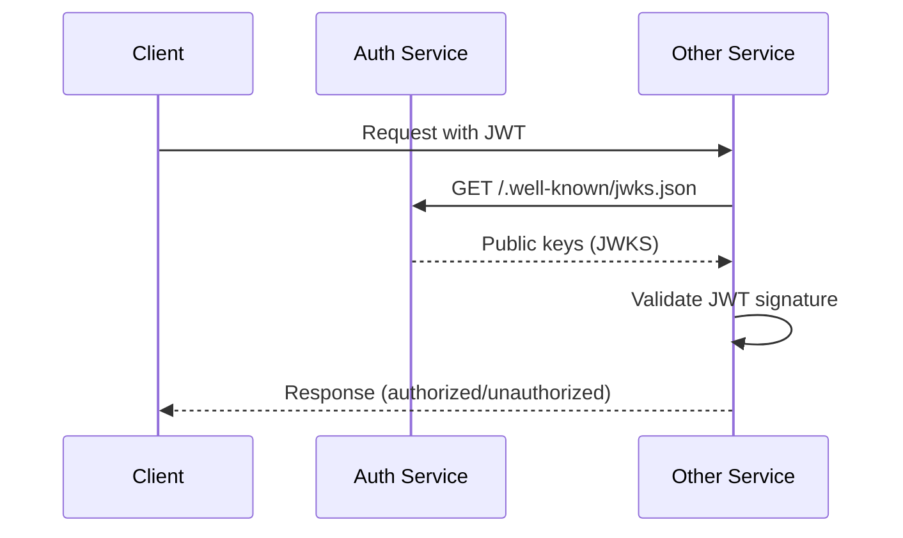

# Task ID: TASK-001 - Implement JWT Infrastructure with RS256 and JWKS

## Description

Implement the core JWT authentication infrastructure for the Auth Service using RS256 algorithm with public/private key pair management and JWKS endpoint for public key distribution to other services.

## Database Schema

### `auth_keys`

```dbml
Table auth_keys {
  id uuid [primary key, default: `gen_random_uuid()`]
  key_id varchar(255) [unique, not null] // JWT key ID for JWKS
  private_key text [not null] // RSA private key (PEM format)
  public_key text [not null] // RSA public key (PEM format)
  algorithm varchar(10) [not null, default: 'RS256']
  is_active boolean [not null, default: true]
  created_at timestamp [not null, default: `now()`]
  expires_at timestamp [not null]
}
```

- `key_id`: Unique identifier for the key pair used in JWKS
- `private_key`: RSA private key in PEM format for signing JWTs
- `public_key`: RSA public key in PEM format for verification
- `algorithm`: Signing algorithm (RS256)
- `is_active`: Flag to enable key rotation without breaking existing tokens
- `expires_at`: Key expiration time for rotation strategy

## HTTP API Endpoints

### `GET /.well-known/jwks.json`

#### Description

Public endpoint that provides JSON Web Key Set (JWKS) containing active public keys for JWT verification by other services and clients.

#### Response:

- `200 OK:` Successfully retrieved JWKS
  - **Content-Type:** `application/json`
  - **Body:**
    ```json
    {
      "keys": [
        {
          "kty": "RSA", // Key type
          "use": "sig", // Key usage (signature)
          "kid": "key_id_123", // Key ID
          "alg": "RS256", // Algorithm
          "n": "base64_encoded_modulus", // RSA public key modulus
          "e": "AQAB" // RSA public key exponent
        }
      ]
    }
    ```

### `POST /api/v1/auth/tokens/refresh`

#### Description

Internal endpoint for refreshing access tokens using valid refresh tokens.

#### Request

- **Body:**
  ```json
  {
    "refresh_token": "jwt_refresh_token_string"
  }
  ```

#### Response:

- `200 OK:` Token successfully refreshed

  - **Content-Type:** `application/json`
  - **Body:**
    ```json
    {
      "access_token": "new_jwt_access_token",
      "token_type": "Bearer",
      "expires_in": 3600 // seconds
    }
    ```

- `401 Unauthorized:` Invalid or expired refresh token
  - **Content-Type:** `application/json`
  - **Body:**
    ```json
    {
      "error": "invalid_grant",
      "error_description": "Invalid or expired refresh token"
    }
    ```

## Design

### JWT Token Infrastructure

**Key Generation and Management:**

- Generate RSA key pairs (2048-bit minimum) for RS256 signing
- Store active keys in database with unique key IDs
- Support key rotation strategy with overlapping validity periods
- **Private keys never leave the Auth Service**

**Token Structure:**

- **Access Token:** Short-lived (15-60 minutes), contains user claims
- **Refresh Token:** Long-lived (7-30 days), used only for token renewal
- Both tokens include `kid` (key ID) header for key identification

**JWKS Endpoint:**

- Expose only public keys in JWKS format
- Cache JWKS response for performance
- Support multiple active keys during rotation periods

### Token Validation Flow

#### Sequence Diagram



### Security Considerations

- **Key Rotation:** Implement automatic key rotation every 30-90 days
- **Algorithm Validation:** Strictly enforce RS256, reject other algorithms
- **Key Storage:** Encrypt private keys at rest
- **Rate Limiting:** Apply rate limits to token refresh endpoint

## TODOs

- `TODO:` Implement key rotation automation
- `TODO:` Add monitoring for token validation failures
- `TODO:` Implement token revocation/blacklisting mechanism
- `TODO:` Add metrics for JWT operations

## References

- [US-001: User Registration](../user_stories.md#us-001-user-registration)
- [System Architecture - Auth Service](../system_architecture.md#21-services)
- [RFC 7517 - JSON Web Key (JWK)](https://tools.ietf.org/html/rfc7517)
- [RFC 7515 - JSON Web Signature (JWS)](https://tools.ietf.org/html/rfc7515)
