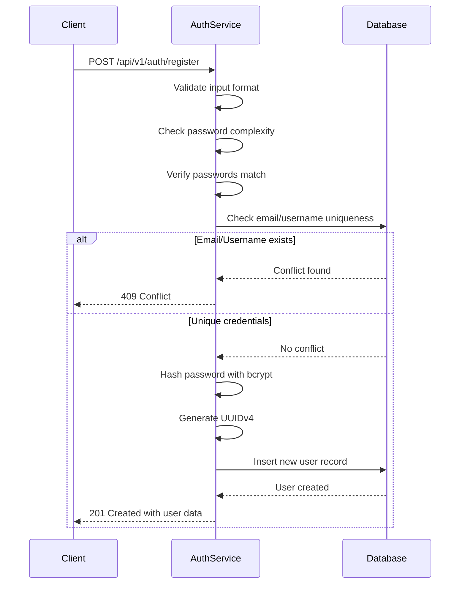

# Task ID: TASK-001 - Implement User Registration

## Description

Implement a complete user registration system that allows new users to create accounts using email/username and password. This includes database schema, validation logic, password hashing, and API endpoint with comprehensive error handling.

## Database Schema

### `users`

```dbml
Table users {
  id uuid [primary key, note: 'UUIDv4 user identifier']
  email varchar(255) [unique, not null, note: 'User email address']
  username varchar(50) [unique, not null, note: 'User chosen username']
  password_hash varchar(255) [not null, note: 'Bcrypt hashed password']
  created_at timestamp [not null, default: 'now()']
  updated_at timestamp [not null, default: 'now()']
  email_verified boolean [not null, default: false]
  is_active boolean [not null, default: true]
}
```

- `id`: Primary key using UUIDv4 format
- `email`: Unique email address with format validation
- `username`: Unique username with length constraints (3-50 chars)
- `password_hash`: Bcrypt hashed password with salt rounds ≥12
- `created_at`: User registration timestamp
- `updated_at`: Last profile update timestamp
- `email_verified`: Email verification status for future email verification feature
- `is_active`: Account status for soft deletion/deactivation

## HTTP API Endpoints

### `POST /api/v1/auth/register`

#### Description

Register a new user account with email/username and password validation. Returns success with user data or detailed validation errors.

#### Request

- **Body:**
  ```javascript
  {
    "email": "user@example.com", // valid email format
    "username": "john_doe", // 3-50 chars, alphanumeric and underscore only
    "password": "SecurePass123!", // min 8 chars, complexity requirements
    "confirm_password": "SecurePass123!" // must match password
  }
  ```

#### Response:

- `201 Created:` User successfully registered

  - **Content-Type:** `application/json`
  - **Body:**
    ```javascript
    {
      "data": {
        "user": {
          "id": "550e8400-e29b-41d4-a716-446655440000",
          "email": "user@example.com",
          "username": "john_doe",
          "created_at": "2024-01-15T10:30:00Z",
          "email_verified": false
        }
      }
    }
    ```

- `400 Bad Request:` Validation errors

  - **Content-Type:** `application/json`
  - **Body:**
    ```javascript
    {
      "error": {
        "code": "VALIDATION_FAILED",
        "message": "Registration validation failed",
        "details": {
          "email": "Invalid email format",
          "username": "Username already exists",
          "password": "Password must contain at least one uppercase letter"
        }
      }
    }
    ```

- `409 Conflict:` Email or username already exists
  - **Content-Type:** `application/json`
  - **Body:**
    ```javascript
    {
      "error": {
        "code": "USER_ALREADY_EXISTS",
        "message": "User with this email or username already exists"
      }
    }
    ```

### `POST /api/v1/auth/check/email`

#### Description

Check if an email is already in use.

#### Request

- **Body:**
  ```javascript
  {
    "email": "user@example.com"
  }
  ```

#### Response:

- `200 OK:` Email is available

- `409 Conflict:` Email already exists

### `POST /api/v1/auth/check/username`

#### Description

Check if a username is already in use.

#### Request

- **Body:**
  ```javascript
  {
    "username": "john_doe"
  }
  ```

#### Response:

- `200 OK:` Username is available

- `409 Conflict:` Username already exists

## Design

### `POST /api/v1/auth/register`

#### Sequence Diagram



#### Validation Rules

**Email Validation:**

- Valid email format using RFC 5322 regex
- Maximum length: 255 characters
- Case-insensitive uniqueness check

**Username Validation:**

- Length: 3-50 characters
- Characters: alphanumeric and underscore only
- Case-sensitive uniqueness check
- Reserved words blacklist (admin, root, api, etc.)

**Password Validation:**

- Minimum length: 8 characters
- Must contain: uppercase, lowercase, number, special character
- Maximum length: 128 characters
- Cannot contain username or email

## Configuration

```yaml
account:
  password:
    bcrypt_rounds: 12
    min_length: 8
    max_length: 128
  username:
    min_length: 3
    max_length: 50
    reserved_words: ["admin", "root", "api", "system", "user"]
  email:
    max_length: 255
```

## Environment Variables

- `DATABASE_URL`: PostgreSQL connection string
- `BCRYPT_ROUNDS`: Password hashing rounds (default: 12)

## Unit Tests

- `test_register_valid_user`: Successful registration with valid data
- `test_register_duplicate_email`: Email already exists error
- `test_register_duplicate_username`: Username already exists error
- `test_register_invalid_email_format`: Invalid email format validation
- `test_register_weak_password`: Password complexity validation
- `test_register_password_mismatch`: Password confirmation mismatch
- `test_register_username_too_short`: Username length validation
- `test_register_reserved_username`: Reserved username rejection
- `test_password_hashing_security`: Verify bcrypt hashing strength

## References

- [US-001: User Registration](../user_stories.md#us-001-user-registration)
- [EPIC-001: User Account Management](../epics.md#epic-001-user-account-management)
