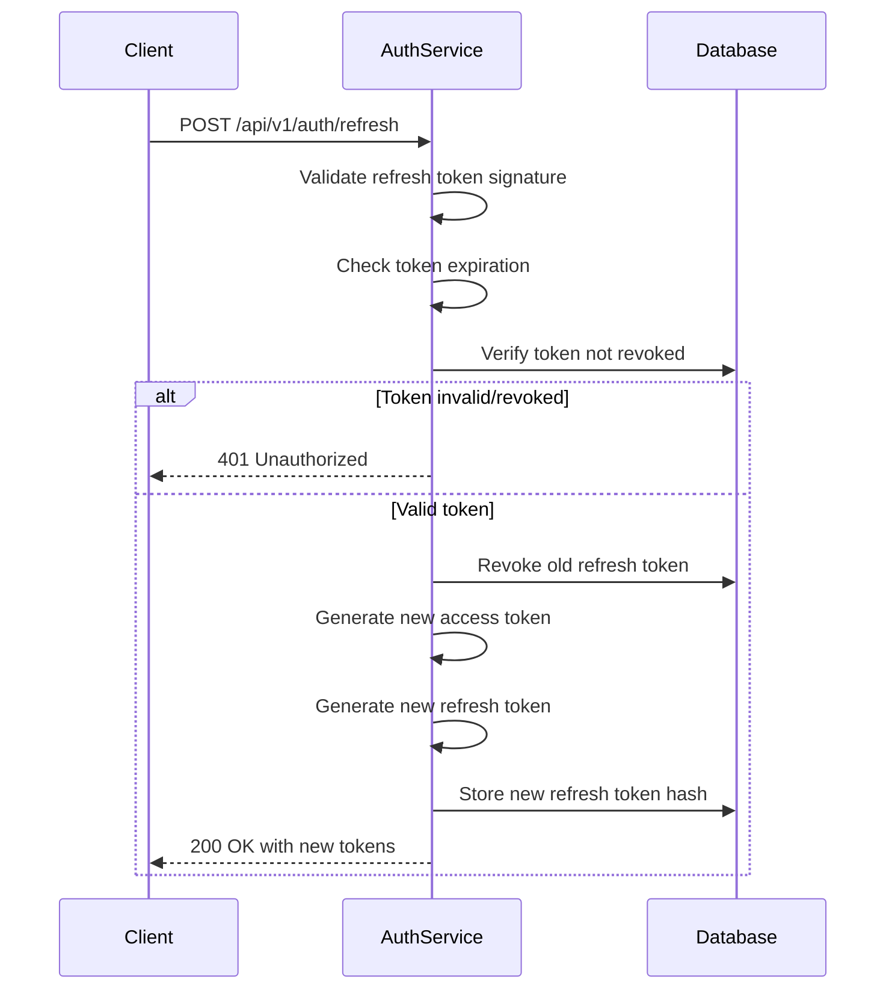

# Task ID: TASK-002 - Implement JWT Authentication System

## Description

Implement a complete JWT authentication system using RS256 algorithm with JWKS (JSON Web Key Set) support. This includes access token and refresh token generation, validation middleware, key management, and the foundational infrastructure needed for user login functionality.

## Database Schema

### `refresh_tokens`

```dbml
Table refresh_tokens {
  id uuid [primary key, note: 'UUIDv4 token identifier']
  user_id uuid [not null, ref: > users.id, note: 'Reference to user']
  token_hash varchar(255) [not null, note: 'Hashed refresh token']
  expires_at timestamp [not null, note: 'Token expiration time']
  created_at timestamp [not null, default: 'now()']
  revoked boolean [not null, default: false]
  device_info varchar(500) [note: 'User agent and device information']
}

Indexes {
  refresh_tokens_user_id [refresh_tokens.user_id]
  refresh_tokens_expires_at [refresh_tokens.expires_at]
}
```

- `id`: Primary key for the refresh token record
- `user_id`: Foreign key reference to users table
- `token_hash`: SHA-256 hash of the refresh token for security
- `expires_at`: Token expiration timestamp (30 days default)
- `revoked`: Token revocation status for logout/security
- `device_info`: Optional device/browser information for security auditing

## HTTP API Endpoints

### `GET /.well-known/jwks.json`

#### Description

Public endpoint exposing the JSON Web Key Set (JWKS) containing public keys for JWT signature verification. This enables other services to validate JWT tokens.

#### Response:

- `200 OK:` JWKS successfully retrieved
  - **Content-Type:** `application/json`
  - **Body:**
    ```javascript
    {
      "keys": [
        {
          "kty": "RSA",
          "use": "sig",
          "kid": "auth-service-key-1",
          "alg": "RS256",
          "n": "base64url-encoded-modulus",
          "e": "AQAB"
        }
      ]
    }
    ```

### `POST /api/v1/auth/refresh`

#### Description

Exchange a valid refresh token for new access and refresh tokens. Implements token rotation for enhanced security.

#### Request

- **Body:**
  ```javascript
  {
    "refresh_token": "eyJhbGciOiJSUzI1NiIsInR5cCI6IkpXVCJ9..." // valid refresh token
  }
  ```

#### Response:

- `200 OK:` Tokens successfully refreshed

  - **Content-Type:** `application/json`
  - **Body:**
    ```javascript
    {
      "data": {
        "access_token": "eyJhbGciOiJSUzI1NiIsInR5cCI6IkpXVCJ9...",
        "refresh_token": "eyJhbGciOiJSUzI1NiIsInR5cCI6IkpXVCJ9...",
        "token_type": "Bearer",
        "expires_in": 3600
      }
    }
    ```

- `401 Unauthorized:` Invalid or expired refresh token
  - **Content-Type:** `application/json`
  - **Body:**
    ```javascript
    {
      "error": {
        "code": "INVALID_REFRESH_TOKEN",
        "message": "Refresh token is invalid or expired"
      }
    }
    ```

### `POST /api/v1/auth/logout`

#### Description

Revoke the current refresh token, effectively logging out the user from this session/device.

#### Request

- **Headers:**
  - `Authorization: Bearer <access_token>`
- **Body:**
  ```javascript
  {
    "refresh_token": "eyJhbGciOiJSUzI1NiIsInR5cCI6IkpXVCJ9..." // refresh token to revoke
  }
  ```

#### Response:

- `200 OK:` Successfully logged out
  - **Content-Type:** `application/json`
  - **Body:**
    ```javascript
    {
      "data": null
    }
    ```

## Design

### JWT Token Structure

**Access Token (15 minutes TTL):**

```javascript
{
  "header": {
    "alg": "RS256",
    "typ": "JWT",
    "kid": "auth-service-key-1"
  },
  "payload": {
    "sub": "550e8400-e29b-41d4-a716-446655440000", // user_id
    "iss": "notepot_auth-service",
    "aud": "notepot-services",
    "exp": 1705312200,
    "iat": 1705311300,
    "jti": "unique-jwt-id",
    "type": "access",
    "username": "test_user",
    "email": "test_user@example.com"
  }
}
```

**Refresh Token (30 days TTL):**

```javascript
{
  "header": {
    "alg": "RS256",
    "typ": "JWT",
    "kid": "auth-service-key-1"
  },
  "payload": {
    "sub": "550e8400-e29b-41d4-a716-446655440000",
    "iss": "notepot_auth-service",
    "aud": "notepot_auth-service",
    "exp": 1707904200,
    "iat": 1705312200,
    "jti": "unique-refresh-jwt-id",
    "type": "refresh"
  }
}
```

### `POST /api/v1/auth/refresh`

#### Notes

- Auto generate a public and private key pair for the JWT token if environment variable `JWT_PRIVATE_KEY` and `JWT_PUBLIC_KEY` are not set. Also log a warning message to the console.

#### Sequence Diagram



#### Key Management

**RSA Key Pair Generation:**

- Key size: 2048 bits minimum
- Algorithm: RS256 (RSA with SHA-256)
- Key rotation: Every 90 days (configurable)
- Key ID format: `auth-service-key-{timestamp}`

**JWKS Endpoint:**

- Public key exposure for signature verification
- Multiple key support for seamless rotation
- Cache-Control headers for performance

## Configuration

```yaml
jwt:
  algorithm: "RS256"
  issuer: "notepot_auth-service"
  audience: "notepot-services"
  access_token:
    ttl_minutes: 15
  refresh_token:
    ttl_days: 30
  keys:
    rotation_days: 90
    key_size: 2048
  jwks:
    cache_ttl_hours: 24
```

## Environment Variables

- `JWT_PRIVATE_KEY`: RSA private key in PEM format (base64 encoded)
- `JWT_PUBLIC_KEY`: RSA public key in PEM format (base64 encoded)
- `JWT_KEY_ID`: Current key identifier
- `JWT_ISSUER`: JWT issuer claim (default:notepot_auth-service)

## Unit Tests

- `test_generate_access_token`: Verify access token generation and claims
- `test_generate_refresh_token`: Verify refresh token generation and storage
- `test_validate_access_token`: Token signature and expiration validation
- `test_refresh_token_rotation`: Old token revocation and new token generation
- `test_jwks_endpoint`: Public key exposure and format validation
- `test_logout_token_revocation`: Refresh token revocation functionality
- `test_expired_token_rejection`: Expired token handling
- `test_invalid_signature_rejection`: Invalid signature detection

## References

- [US-002: User Login](../user_stories.md#us-002-user-login)
- [US-003: User Login with Third-Party Authentication](../user_stories.md#us-003-user-login-with-third-party-authentication)
- [EPIC-001: User Account Management](../epics.md#epic-001-user-account-management)
- [TASK-001: Implement User Registration](TASK_001_implement_user_registration.md)
