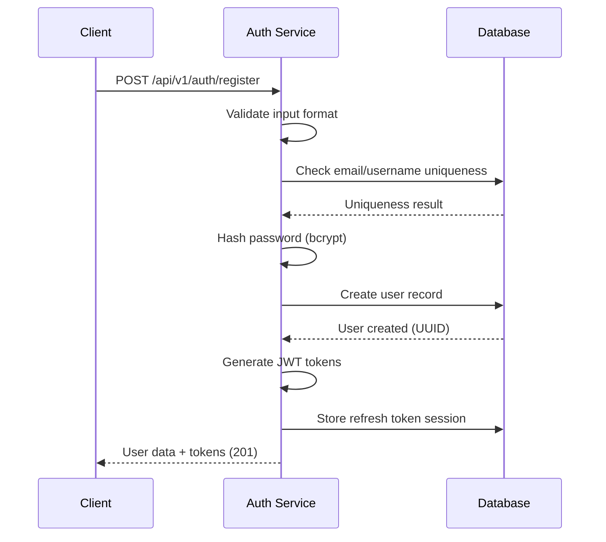

# Task ID: TASK-002 - Implement User Registration API with Validation

## Description

Implement the user registration API endpoint with comprehensive validation for email/username uniqueness, password complexity requirements, and secure user account creation with UUIDv4 user IDs.

## Database Schema

### `users`

```dbml
Table users {
  id uuid [primary key, default: `gen_random_uuid()`]
  username varchar(255) [unique, not null]
  email varchar(255) [unique, not null]
  password_hash varchar(255) [not null] // bcrypt hash
  email_verified boolean [not null, default: false]
  is_active boolean [not null, default: true]
  created_at timestamp [not null, default: `now()`]
  updated_at timestamp [not null, default: `now()`]
  last_login_at timestamp [null]
}
```

- `id`: UUIDv4 primary identifier for the user
- `username`: Unique username for login (3-30 characters, alphanumeric + underscore)
- `email`: Unique email address for login and notifications
- `password_hash`: bcrypt hashed password (cost factor 12+)
- `email_verified`: Flag for email verification status
- `is_active`: Account status flag for soft deletion/suspension

### `user_sessions`

```dbml
Table user_sessions {
  id uuid [primary key, default: `gen_random_uuid()`]
  user_id uuid [not null, ref: > users.id]
  refresh_token_hash varchar(255) [not null] // bcrypt hash of refresh token
  device_info text [null] // User agent and device information
  ip_address inet [null]
  expires_at timestamp [not null]
  created_at timestamp [not null, default: `now()`]
  last_used_at timestamp [not null, default: `now()`]
}
```

- `refresh_token_hash`: Hashed refresh token for secure storage
- `device_info`: Optional device/browser information for session management
- `ip_address`: Client IP for security auditing

## HTTP API Endpoints

### `POST /api/v1/auth/register`

#### Description

Register a new user account with email/username and password validation, returning authentication tokens upon successful registration.

#### Request

- **Body:**
  ```json
  {
    "email": "user@example.com",
    "username": "john_doe", // optional, defaults to email prefix if not provided
    "password": "SecurePassword123!",
    "password_confirmation": "SecurePassword123!"
  }
  ```

#### Response:

- `201 Created:` User successfully registered and logged in

  - **Content-Type:** `application/json`
  - **Body:**
    ```json
    {
      "user": {
        "id": "123e4567-e89b-12d3-a456-426614174000",
        "username": "john_doe",
        "email": "user@example.com",
        "email_verified": false,
        "created_at": "2024-01-01T00:00:00Z"
      },
      "tokens": {
        "access_token": "jwt_access_token_string",
        "refresh_token": "jwt_refresh_token_string",
        "token_type": "Bearer",
        "expires_in": 3600
      }
    }
    ```

- `400 Bad Request:` Validation errors

  - **Content-Type:** `application/json`
  - **Body:**
    ```json
    {
      "error": "validation_failed",
      "error_description": "Request validation failed",
      "details": {
        "email": ["Invalid email format"],
        "username": ["Username already taken"],
        "password": [
          "Password must contain at least 8 characters, including uppercase, lowercase, number, and special character"
        ],
        "password_confirmation": ["Passwords do not match"]
      }
    }
    ```

- `409 Conflict:` Email or username already exists

  - **Content-Type:** `application/json`
  - **Body:**
    ```json
    {
      "error": "user_exists",
      "error_description": "User with this email or username already exists"
    }
    ```

- `422 Unprocessable Entity:` Password complexity requirements not met
  - **Content-Type:** `application/json`
  - **Body:**
    ```json
    {
      "error": "weak_password",
      "error_description": "Password does not meet security requirements",
      "requirements": [
        "Minimum 8 characters",
        "At least one uppercase letter",
        "At least one lowercase letter",
        "At least one number",
        "At least one special character (!@#$%^&*)"
      ]
    }
    ```

## Design

### Registration Flow

**Input Validation:**

- **Email:** RFC 5322 compliant format validation
- **Username:** 3-30 characters, alphanumeric plus underscore, case-insensitive uniqueness
- **Password:** Minimum complexity requirements with clear error messages
- **Password Confirmation:** Must match password exactly

**Security Measures:**

- **Password Hashing:** bcrypt with cost factor 12+ for secure storage
- **Rate Limiting:** Limit registration attempts by IP (e.g., 5 per hour)
- **Input Sanitization:** Trim whitespace, normalize email case
- **Token Generation:** Immediate authentication upon successful registration

### User Registration Process

#### Sequence Diagram



### Validation Rules

**Email Validation:**

- Valid RFC 5322 format
- Maximum 254 characters
- Case-insensitive uniqueness check
- No disposable email domains (future enhancement)

**Username Validation:**

- 3-30 characters length
- Alphanumeric characters and underscore only
- Cannot start with underscore
- Case-insensitive uniqueness
- Reserved usernames blacklist (admin, api, support, etc.)

**Password Complexity:**

- Minimum 8 characters, maximum 128 characters
- At least one uppercase letter (A-Z)
- At least one lowercase letter (a-z)
- At least one digit (0-9)
- At least one special character (!@#$%^&\*)
- No common passwords or dictionary words

## TODOs

- `TODO:` Implement email verification workflow
- `TODO:` Add password strength meter integration
- `TODO:` Implement account lockout after failed attempts
- `TODO:` Add social media registration options
- `TODO:` Implement username suggestion for conflicts

## References

- [US-001: User Registration](../user_stories.md#us-001-user-registration)
- [TASK-001: JWT Infrastructure](./TASK_001_implement_jwt_infrastructure.md)
- [System Architecture - Auth Service](../system_architecture.md#21-services)
- [OWASP Password Storage Guidelines](https://cheatsheetseries.owasp.org/cheatsheets/Password_Storage_Cheat_Sheet.html)
