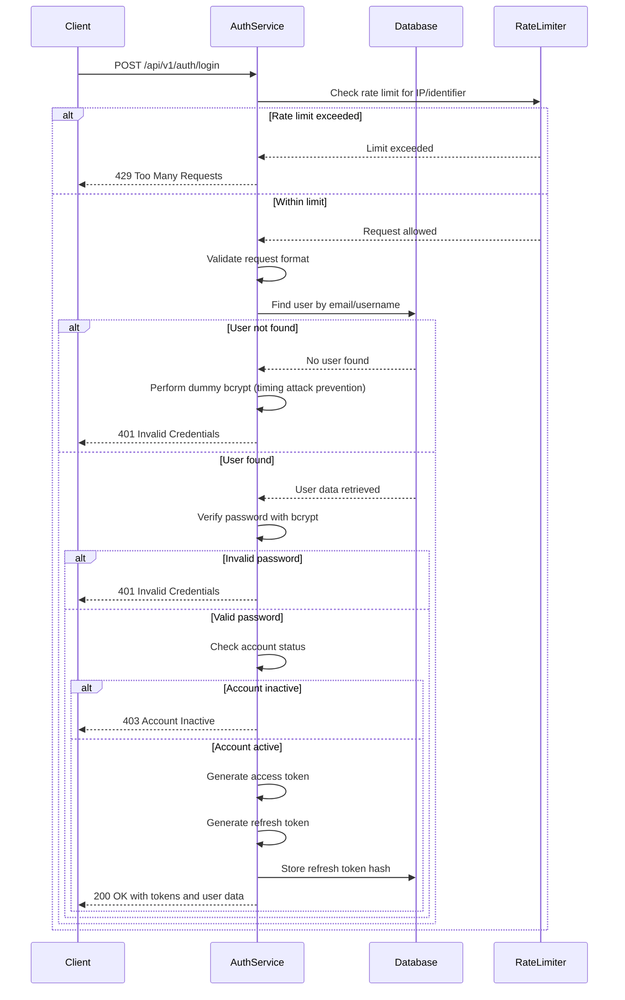

# Task ID: TASK-003 - Implement User Login

## Description

Implement user login functionality that allows existing users to authenticate using email/username and password. This builds on the user registration and JWT authentication systems to provide complete login workflow with credential validation, JWT token generation, and secure session management.

## HTTP API Endpoints

### `POST /api/v1/auth/login`

#### Description

Authenticate a user with email/username and password, returning JWT access and refresh tokens upon successful validation.

#### Request

- **Body:**
  ```javascript
  {
    "identifier": "user@example.com", // email or username
    "password": "SecurePass123!" // user's password
  }
  ```

#### Response:

- `200 OK:` Login successful

  - **Content-Type:** `application/json`
  - **Body:**
    ```javascript
    {
      "data": {
        "user": {
          "id": "550e8400-e29b-41d4-a716-446655440000",
          "email": "user@example.com",
          "username": "john_doe",
          "email_verified": false
        },
        "tokens": {
          "access_token": "eyJhbGciOiJSUzI1NiIsInR5cCI6IkpXVCJ9...",
          "refresh_token": "eyJhbGciOiJSUzI1NiIsInR5cCI6IkpXVCJ9...",
          "token_type": "Bearer",
          "expires_in": 900
        }
      }
    }
    ```

- `400 Bad Request:` Invalid request format

  - **Content-Type:** `application/json`
  - **Body:**
    ```javascript
    {
      "error": {
        "code": "INVALID_REQUEST",
        "message": "Invalid login request format"
      }
    }
    ```

- `401 Unauthorized:` Invalid credentials

  - **Content-Type:** `application/json`
  - **Body:**
    ```javascript
    {
      "error": {
        "code": "INVALID_CREDENTIALS",
        "message": "Invalid email/username or password"
      }
    }
    ```

- `403 Forbidden:` Account inactive or locked

  - **Content-Type:** `application/json`
  - **Body:**
    ```javascript
    {
      "error": {
        "code": "ACCOUNT_INACTIVE",
        "message": "Account is inactive or suspended"
      }
    }
    ```

- `429 Too Many Requests:` Rate limit exceeded
  - **Content-Type:** `application/json`
  - **Body:**
    ```javascript
    {
      "error": {
        "code": "RATE_LIMIT_EXCEEDED",
        "message": "Too many login attempts. Please try again later"
      }
    }
    ```

## Design

### `POST /api/v1/auth/login`

#### Sequence Diagram



#### Authentication Logic

**Identifier Resolution:**

- Support both email and username login
- Case-insensitive email matching
- Case-sensitive username matching
- Normalize email to lowercase before database query

**Password Verification:**

- Use bcrypt.compare() for secure password validation
- Implement constant-time comparison to prevent timing attacks
- Perform dummy bcrypt operation when user not found

**Security Features:**

- Rate limiting: 5 attempts per IP per 15 minutes
- Account lockout: After 10 failed attempts in 1 hour
- Audit logging: All login attempts (success/failure)
- Device fingerprinting: Store device info with refresh tokens

#### Rate Limiting

**Implementation Strategy:**

- Redis-based sliding window rate limiter
- Multiple rate limit buckets:
  - Per IP address: 20 requests/15 minutes
  - Per identifier: 5 attempts/15 minutes
  - Per account: 10 attempts/1 hour

## Configuration

```yaml
login:
  rate_limits:
    per_ip:
      requests: 20
      window_minutes: 15
    per_identifier:
      attempts: 5
      window_minutes: 15
    per_account:
      attempts: 10
      window_minutes: 60
  security:
    enable_account_lockout: true
    lockout_duration_minutes: 60
    enable_audit_logging: true
  session:
    device_tracking: true
    max_sessions_per_user: 10
```

## Environment Variables

- `REDIS_URL`: Redis connection string for rate limiting
- `LOGIN_RATE_LIMIT_ENABLED`: Enable/disable rate limiting (default: true)
- `AUDIT_LOG_LEVEL`: Audit logging level (default: info)

## Unit Tests

- `test_login_valid_email`: Successful login with email
- `test_login_valid_username`: Successful login with username
- `test_login_invalid_email`: Invalid email format handling
- `test_login_wrong_password`: Wrong password rejection
- `test_login_nonexistent_user`: Non-existent user handling
- `test_login_inactive_account`: Inactive account rejection
- `test_login_rate_limiting`: Rate limit enforcement
- `test_login_case_insensitive_email`: Email case insensitivity
- `test_login_case_sensitive_username`: Username case sensitivity
- `test_login_timing_attack_prevention`: Consistent response times
- `test_token_generation_on_login`: JWT tokens created correctly
- `test_refresh_token_storage`: Refresh token hash stored securely

## References

- [US-002: User Login](../user_stories.md#us-002-user-login)
- [EPIC-001: User Account Management](../epics.md#epic-001-user-account-management)
- [TASK-001: Implement User Registration](TASK_001_implement_user_registration.md)
- [TASK-002: Implement JWT Authentication System](TASK_002_implement_jwt_auth_system.md)
