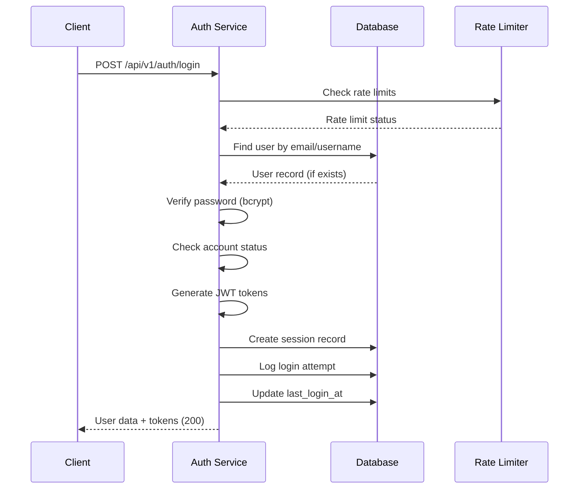

# Task ID: TASK-003 - Implement User Login API with Authentication

## Description

Implement the user login API endpoint that authenticates users with email/username and password, generates JWT tokens, and manages user sessions with comprehensive security measures.

## Database Schema

### `users` [#](./TASK_002_implement_user_registration_api.md#users)

- Uses existing user table structure from TASK-002

### `user_sessions` [#](./TASK_002_implement_user_registration_api.md#user_sessions)

- Extends existing session management for login tracking

### `login_attempts`

```dbml
Table login_attempts {
  id uuid [primary key, default: `gen_random_uuid()`]
  email_or_username varchar(255) [not null]
  ip_address inet [not null]
  user_agent text [null]
  success boolean [not null, default: false]
  failure_reason varchar(50) [null] // 'invalid_credentials', 'account_locked', 'account_inactive'
  created_at timestamp [not null, default: `now()`]
}
```

- `email_or_username`: Login identifier used (for tracking attack patterns)
- `failure_reason`: Categorized reason for failed login attempts
- `success`: Flag to track successful vs failed attempts

## HTTP API Endpoints

### `POST /api/v1/auth/login`

#### Description

Authenticate user with email/username and password, returning JWT tokens and user information upon successful authentication.

#### Request

- **Body:**
  ```json
  {
    "login": "user@example.com", // email or username
    "password": "SecurePassword123!",
    "device_info": "Mozilla/5.0..." // optional browser/device info
  }
  ```

#### Response:

- `200 OK:` User successfully authenticated

  - **Content-Type:** `application/json`
  - **Body:**
    ```json
    {
      "user": {
        "id": "123e4567-e89b-12d3-a456-426614174000",
        "username": "john_doe",
        "email": "user@example.com",
        "email_verified": true,
        "last_login_at": "2024-01-01T00:00:00Z"
      },
      "tokens": {
        "access_token": "jwt_access_token_string",
        "refresh_token": "jwt_refresh_token_string",
        "token_type": "Bearer",
        "expires_in": 3600
      }
    }
    ```

- `400 Bad Request:` Invalid request format

  - **Content-Type:** `application/json`
  - **Body:**
    ```json
    {
      "error": "invalid_request",
      "error_description": "Login and password are required"
    }
    ```

- `401 Unauthorized:` Invalid credentials

  - **Content-Type:** `application/json`
  - **Body:**
    ```json
    {
      "error": "invalid_credentials",
      "error_description": "Invalid email/username or password"
    }
    ```

- `403 Forbidden:` Account locked or inactive

  - **Content-Type:** `application/json`
  - **Body:**
    ```json
    {
      "error": "account_locked",
      "error_description": "Account temporarily locked due to multiple failed login attempts",
      "locked_until": "2024-01-01T01:00:00Z"
    }
    ```

- `429 Too Many Requests:` Rate limit exceeded
  - **Content-Type:** `application/json`
  - **Body:**
    ```json
    {
      "error": "rate_limit_exceeded",
      "error_description": "Too many login attempts. Please try again later.",
      "retry_after": 300
    }
    ```

### `POST /api/v1/auth/logout`

#### Description

Invalidate user session and refresh token, effectively logging the user out from the current device.

#### Request

- **Headers:**
  - `Authorization: Bearer <access_token>`
- **Body:**
  ```json
  {
    "refresh_token": "jwt_refresh_token_string" // optional, for single device logout
  }
  ```

#### Response:

- `200 OK:` Successfully logged out

  - **Content-Type:** `application/json`
  - **Body:**
    ```json
    {
      "message": "Successfully logged out"
    }
    ```

- `401 Unauthorized:` Invalid or expired token
  - **Content-Type:** `application/json`
  - **Body:**
    ```json
    {
      "error": "unauthorized",
      "error_description": "Invalid or expired access token"
    }
    ```

## Design

### Authentication Flow

**Login Process:**

1. **Input Validation:** Verify login identifier and password presence
2. **User Lookup:** Find user by email or username (case-insensitive)
3. **Rate Limiting:** Check for excessive failed attempts by IP/user
4. **Password Verification:** Compare with bcrypt hash
5. **Account Status:** Verify account is active and not locked
6. **Token Generation:** Create access and refresh JWT tokens
7. **Session Creation:** Store refresh token session in database
8. **Audit Logging:** Record login attempt (success/failure)

### Login Authentication Process

#### Sequence Diagram



### Security Measures

**Rate Limiting:**

- **Per IP:** Maximum 10 login attempts per 15 minutes
- **Per User:** Maximum 5 failed attempts before temporary lockout
- **Progressive Delays:** Exponential backoff for repeated failures

**Password Security:**

- **Constant-Time Comparison:** Prevent timing attacks
- **Hash Verification:** bcrypt compare with stored hash
- **No Password Exposure:** Never return password in responses

**Account Protection:**

- **Temporary Lockout:** 15-30 minutes after 5 failed attempts
- **Account Status Check:** Verify active and not suspended
- **Audit Trail:** Log all authentication attempts

**Session Management:**

- **Single Device Logout:** Invalidate specific refresh token
- **Session Tracking:** Store device info and IP for security
- **Token Expiration:** Enforce access token lifetime

### Error Handling Strategy

**Consistent Response Times:**

- Invalid user and invalid password return similar response times
- Prevent user enumeration attacks through timing analysis

**Generic Error Messages:**

- Avoid specific details about why authentication failed
- Use generic "invalid credentials" for security

**Lockout Notifications:**

- Clear communication about account lockout status
- Provide lockout duration for user experience

## TODOs

- `TODO:` Implement remember me functionality
- `TODO:` Add geolocation-based security alerts
- `TODO:` Implement device fingerprinting
- `TODO:` Add multi-factor authentication support
- `TODO:` Implement suspicious activity detection

## References

- [US-001: User Registration](../user_stories.md#us-001-user-registration)
- [TASK-001: JWT Infrastructure](./TASK_001_implement_jwt_infrastructure.md)
- [TASK-002: User Registration API](./TASK_002_implement_user_registration_api.md)
- [System Architecture - Auth Service](../system_architecture.md#21-services)
- [OWASP Authentication Guidelines](https://cheatsheetseries.owasp.org/cheatsheets/Authentication_Cheat_Sheet.html)
