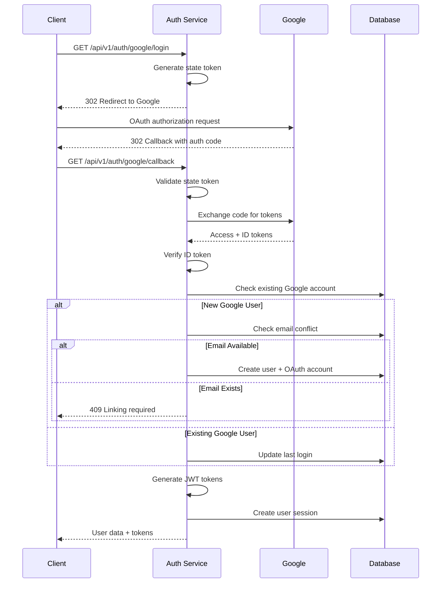

# Task ID: TASK-004 - Implement Google OAuth Login

## Description

Implement Google OAuth2 authentication flow with account creation/linking and JWT token generation, supporting direct login via Google accounts without complex provider abstraction.

## Database Schema

### `user_oauth_accounts`

```dbml
Table user_oauth_accounts {
  id uuid [primary key, default: `gen_random_uuid()`]
  user_id uuid [not null, ref: > users.id]
  provider varchar(20) [not null] // 'google' or 'github'
  provider_user_id varchar(255) [not null] // Google user ID
  email varchar(255) [not null]
  display_name varchar(255) [null]
  avatar_url varchar(500) [null]
  created_at timestamp [not null, default: `now()`]
  updated_at timestamp [not null, default: `now()`]
  last_login_at timestamp [null]

  indexes {
    (provider, provider_user_id) [unique]
    (provider, email)
  }
}
```

- `provider`: OAuth provider ('google' or 'github')
- `provider_user_id`: Unique user ID from Google
- `email`: User's email from Google account
- `display_name`: User's display name from Google
- `avatar_url`: Profile picture URL from Google

## HTTP API Endpoints

### `GET /api/v1/auth/google/login`

#### Description

Initiate Google OAuth2 authentication flow by redirecting user to Google's authorization endpoint.

#### Request

- **Query:**
  ```json
  {
    "redirect_uri": "https://app.example.com/dashboard" // optional, where to redirect after success
  }
  ```

#### Response:

- `302 Found:` Redirect to Google OAuth

  - **Headers:**
    - `Location: https://accounts.google.com/o/oauth2/v2/auth?client_id=...&redirect_uri=...&scope=openid+email+profile&state=...`
  - **Set-Cookie:**
    - `oauth_state=encrypted_state; HttpOnly; Secure; SameSite=Lax; Max-Age=600`

- `503 Service Unavailable:` Google OAuth not configured
  - **Content-Type:** `application/json`
  - **Body:**
    ```json
    {
      "error": "oauth_unavailable",
      "error_description": "Google OAuth is not configured"
    }
    ```

### `GET /api/v1/auth/google/callback`

#### Description

Handle Google OAuth callback, exchange authorization code for tokens, create/link user account, and return JWT tokens.

#### Request

- **Query:**
  ```json
  {
    "code": "authorization_code_from_google",
    "state": "anti_csrf_state_token",
    "error": "access_denied" // optional, if user denies access
  }
  ```

#### Response:

- `201 Created:` New user account created and logged in

  - **Content-Type:** `application/json`
  - **Body:**
    ```json
    {
      "user": {
        "id": "123e4567-e89b-12d3-a456-426614174000",
        "username": "john_doe_google",
        "email": "john@gmail.com",
        "email_verified": true,
        "created_at": "2024-01-01T00:00:00Z"
      },
      "tokens": {
        "access_token": "jwt_access_token_string",
        "refresh_token": "jwt_refresh_token_string",
        "token_type": "Bearer",
        "expires_in": 3600
      },
      "is_new_user": true,
      "redirect_uri": "https://app.example.com/dashboard"
    }
    ```

- `200 OK:` Existing user logged in

  - **Content-Type:** `application/json`
  - **Body:**
    ```json
    {
      "user": {
        "id": "123e4567-e89b-12d3-a456-426614174000",
        "username": "john_doe",
        "email": "john@gmail.com",
        "email_verified": true,
        "last_login_at": "2024-01-01T12:00:00Z"
      },
      "tokens": {
        "access_token": "jwt_access_token_string",
        "refresh_token": "jwt_refresh_token_string",
        "token_type": "Bearer",
        "expires_in": 3600
      },
      "is_new_user": false,
      "redirect_uri": "https://app.example.com/dashboard"
    }
    ```

- `409 Conflict:` Email exists with password account, linking required

  - **Content-Type:** `application/json`
  - **Body:**
    ```json
    {
      "error": "account_exists",
      "error_description": "An account with this email already exists. Please link your Google account.",
      "linking_required": true,
      "link_endpoint": "/api/v1/auth/google/link"
    }
    ```

- `400 Bad Request:` Invalid callback or expired state
  - **Content-Type:** `application/json`
  - **Body:**
    ```json
    {
      "error": "invalid_request",
      "error_description": "Invalid authorization code or expired state"
    }
    ```

### `POST /api/v1/auth/google/link`

#### Description

Link Google account to existing user account by verifying password and completing the OAuth linkage.

#### Request

- **Headers:**
  - `Cookie: oauth_state=encrypted_state`
- **Body:**
  ```json
  {
    "email": "john@gmail.com",
    "password": "user_current_password"
  }
  ```

#### Response:

- `200 OK:` Google account successfully linked

  - **Content-Type:** `application/json`
  - **Body:**
    ```json
    {
      "user": {
        "id": "123e4567-e89b-12d3-a456-426614174000",
        "username": "john_doe",
        "email": "john@gmail.com",
        "email_verified": true,
        "oauth_providers": ["google"]
      },
      "tokens": {
        "access_token": "jwt_access_token_string",
        "refresh_token": "jwt_refresh_token_string",
        "token_type": "Bearer",
        "expires_in": 3600
      },
      "message": "Google account linked successfully"
    }
    ```

- `401 Unauthorized:` Invalid password
  - **Content-Type:** `application/json`
  - **Body:**
    ```json
    {
      "error": "invalid_credentials",
      "error_description": "Invalid password"
    }
    ```

## Design

### Google OAuth Configuration

**Environment Variables:**

```bash
GOOGLE_CLIENT_ID=your_google_client_id
GOOGLE_CLIENT_SECRET=your_google_client_secret
GOOGLE_REDIRECT_URI=https://api.yourapp.com/api/v1/auth/google/callback
```

**OAuth Scopes:**

- `openid`: OpenID Connect authentication
- `email`: Access to user's email address
- `profile`: Access to basic profile information

### Google Authentication Flow

**Flow Steps:**

1. Generate secure random state token (32 bytes)
2. Store state with expiration (10 minutes) in session/cookie
3. Redirect to Google with required parameters
4. Handle callback with authorization code
5. Exchange code for access token and ID token
6. Verify ID token and extract user info
7. Check for existing user by Google ID or email
8. Create new user or link to existing account
9. Generate JWT tokens and create session

#### Sequence Diagram



### Security Considerations

**State Management:**

- Generate cryptographically secure state tokens
- Store state temporarily with short expiration
- Validate state on callback to prevent CSRF attacks
- Single-use state tokens to prevent replay attacks

**ID Token Verification:**

- Verify token signature using Google's public keys
- Validate issuer, audience, and expiration claims
- Extract verified email and user information
- Reject tokens with invalid or expired claims

**Account Linking:**

- Require password verification for linking existing accounts
- Prevent account takeover through email enumeration
- Log all account linking activities for audit trail
- Support unlinking Google accounts (future enhancement)

## TODOs

- `TODO:` Implement Google account unlinking functionality
- `TODO:` Add support for Google Workspace domain restrictions
- `TODO:` Implement profile photo caching and resizing
- `TODO:` Add Google token refresh for long-lived sessions
- `TODO:` Implement suspicious login detection and alerts

## References

- [US-003: Third-Party Authentication](../user_stories.md#us-003-user-login-with-third-party-authentication)
- [TASK-001: JWT Infrastructure](./TASK_001_implement_jwt_infrastructure.md)
- [TASK-002: User Registration API](./TASK_002_implement_user_registration_api.md)
- [System Architecture - Auth Service](../system_architecture.md#21-services)
- [Google OAuth 2.0 Documentation](https://developers.google.com/identity/protocols/oauth2)
- [Google OpenID Connect](https://developers.google.com/identity/protocols/openidconnect)
