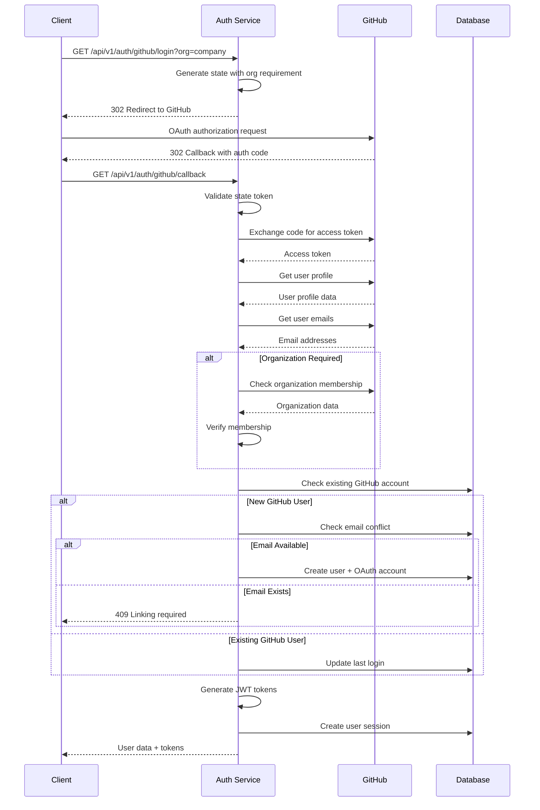

# Task ID: TASK-005 - Implement GitHub OAuth Login

## Description

Implement GitHub OAuth2 authentication flow with account creation/linking and JWT token generation, supporting direct login via GitHub accounts with organization membership verification.

## Database Schema

### `user_oauth_accounts` [#](./TASK_004_implement_google_oauth_login.md#user_oauth_accounts)

- Uses existing OAuth accounts table from TASK-004
- GitHub entries will have `provider = 'github'`

## HTTP API Endpoints

### `GET /api/v1/auth/github/login`

#### Description

Initiate GitHub OAuth2 authentication flow by redirecting user to GitHub's authorization endpoint.

#### Request

- **Query:**
  ```json
  {
    "redirect_uri": "https://app.example.com/dashboard", // optional, where to redirect after success
    "org": "company-org" // optional, require organization membership
  }
  ```

#### Response:

- `302 Found:` Redirect to GitHub OAuth

  - **Headers:**
    - `Location: https://github.com/login/oauth/authorize?client_id=...&redirect_uri=...&scope=user:email&state=...`
  - **Set-Cookie:**
    - `oauth_state=encrypted_state; HttpOnly; Secure; SameSite=Lax; Max-Age=600`

- `503 Service Unavailable:` GitHub OAuth not configured
  - **Content-Type:** `application/json`
  - **Body:**
    ```json
    {
      "error": "oauth_unavailable",
      "error_description": "GitHub OAuth is not configured"
    }
    ```

### `GET /api/v1/auth/github/callback`

#### Description

Handle GitHub OAuth callback, exchange authorization code for access token, verify organization membership (if required), create/link user account, and return JWT tokens.

#### Request

- **Query:**
  ```json
  {
    "code": "authorization_code_from_github",
    "state": "anti_csrf_state_token",
    "error": "access_denied" // optional, if user denies access
  }
  ```

#### Response:

- `201 Created:` New user account created and logged in

  - **Content-Type:** `application/json`
  - **Body:**
    ```json
    {
      "user": {
        "id": "123e4567-e89b-12d3-a456-426614174000",
        "username": "john_doe_github",
        "email": "john@users.noreply.github.com",
        "email_verified": false,
        "created_at": "2024-01-01T00:00:00Z"
      },
      "tokens": {
        "access_token": "jwt_access_token_string",
        "refresh_token": "jwt_refresh_token_string",
        "token_type": "Bearer",
        "expires_in": 3600
      },
      "is_new_user": true,
      "redirect_uri": "https://app.example.com/dashboard"
    }
    ```

- `200 OK:` Existing user logged in

  - **Content-Type:** `application/json`
  - **Body:**
    ```json
    {
      "user": {
        "id": "123e4567-e89b-12d3-a456-426614174000",
        "username": "john_doe",
        "email": "john@users.noreply.github.com",
        "email_verified": false,
        "last_login_at": "2024-01-01T12:00:00Z"
      },
      "tokens": {
        "access_token": "jwt_access_token_string",
        "refresh_token": "jwt_refresh_token_string",
        "token_type": "Bearer",
        "expires_in": 3600
      },
      "is_new_user": false,
      "redirect_uri": "https://app.example.com/dashboard"
    }
    ```

- `409 Conflict:` Email exists with password account, linking required

  - **Content-Type:** `application/json`
  - **Body:**
    ```json
    {
      "error": "account_exists",
      "error_description": "An account with this email already exists. Please link your GitHub account.",
      "linking_required": true,
      "link_endpoint": "/api/v1/auth/github/link"
    }
    ```

- `403 Forbidden:` Organization membership required but not found

  - **Content-Type:** `application/json`
  - **Body:**
    ```json
    {
      "error": "organization_required",
      "error_description": "Membership in the required organization is not found",
      "required_organization": "company-org"
    }
    ```

- `400 Bad Request:` Invalid callback or expired state
  - **Content-Type:** `application/json`
  - **Body:**
    ```json
    {
      "error": "invalid_request",
      "error_description": "Invalid authorization code or expired state"
    }
    ```

### `POST /api/v1/auth/github/link`

#### Description

Link GitHub account to existing user account by verifying password and completing the OAuth linkage.

#### Request

- **Headers:**
  - `Cookie: oauth_state=encrypted_state`
- **Body:**
  ```json
  {
    "email": "john@example.com",
    "password": "user_current_password"
  }
  ```

#### Response:

- `200 OK:` GitHub account successfully linked

  - **Content-Type:** `application/json`
  - **Body:**
    ```json
    {
      "user": {
        "id": "123e4567-e89b-12d3-a456-426614174000",
        "username": "john_doe",
        "email": "john@example.com",
        "email_verified": true,
        "oauth_providers": ["github"]
      },
      "tokens": {
        "access_token": "jwt_access_token_string",
        "refresh_token": "jwt_refresh_token_string",
        "token_type": "Bearer",
        "expires_in": 3600
      },
      "message": "GitHub account linked successfully"
    }
    ```

- `401 Unauthorized:` Invalid password
  - **Content-Type:** `application/json`
  - **Body:**
    ```json
    {
      "error": "invalid_credentials",
      "error_description": "Invalid password"
    }
    ```

## Design

### GitHub OAuth Configuration

**Environment Variables:**

```bash
GITHUB_CLIENT_ID=your_github_client_id
GITHUB_CLIENT_SECRET=your_github_client_secret
GITHUB_REDIRECT_URI=https://api.yourapp.com/api/v1/auth/github/callback
GITHUB_REQUIRED_ORG=company-org  # optional, require organization membership
```

**OAuth Scopes:**

- `user:email`: Access to user's email addresses (including private)
- `read:org`: Access to organization membership (if org verification required)

### GitHub Authentication Flow

**Flow Steps:**

1. Generate secure random state token (32 bytes)
2. Store state with optional organization requirement
3. Redirect to GitHub with required scopes
4. Handle callback with authorization code
5. Exchange code for access token
6. Fetch user profile and email addresses
7. Verify organization membership (if required)
8. Check for existing user by GitHub ID or email
9. Create new user or link to existing account
10. Generate JWT tokens and create session

#### Sequence Diagram



### GitHub-Specific Features

**Email Handling:**

- Fetch all user email addresses from GitHub API
- Prefer primary verified email over noreply addresses
- Handle private email addresses appropriately
- Map GitHub login as fallback if no public email

**Organization Verification:**

- Check user's organization memberships via GitHub API
- Support both public and private organization memberships
- Respect organization privacy settings
- Allow configurable organization requirements

**User Profile Mapping:**

```go
type GitHubUserProfile struct {
    ID        int    `json:"id"`
    Login     string `json:"login"`
    Name      string `json:"name"`
    Email     string `json:"email"`
    AvatarURL string `json:"avatar_url"`
    Company   string `json:"company"`
    Location  string `json:"location"`
    Bio       string `json:"bio"`
}

type GitHubEmail struct {
    Email    string `json:"email"`
    Primary  bool   `json:"primary"`
    Verified bool   `json:"verified"`
    Visibility string `json:"visibility"`
}
```

### Security Considerations

**State Management:**

- Same security measures as Google OAuth
- Include organization requirements in state validation
- Prevent state tampering and replay attacks

**Organization Verification:**

- Only accept verified organization memberships
- Handle private organization memberships securely
- Log organization verification attempts
- Support multiple allowed organizations

**Email Privacy:**

- Handle GitHub's private email addresses (`@users.noreply.github.com`)
- Respect user's email privacy settings
- Provide option to update email after registration
- Don't force email verification for GitHub accounts

## TODOs

- `TODO:` Implement GitHub account unlinking functionality
- `TODO:` Add support for GitHub Enterprise Server instances
- `TODO:` Implement GitHub team-based access control
- `TODO:` Add GitHub SSH key import for development access
- `TODO:` Implement repository access verification

## References

- [US-003: Third-Party Authentication](../user_stories.md#us-003-user-login-with-third-party-authentication)
- [TASK-001: JWT Infrastructure](./TASK_001_implement_jwt_infrastructure.md)
- [TASK-002: User Registration API](./TASK_002_implement_user_registration_api.md)
- [TASK-004: Google OAuth Login](./TASK_004_implement_google_oauth_login.md)
- [System Architecture - Auth Service](../system_architecture.md#21-services)
- [GitHub OAuth Documentation](https://docs.github.com/en/developers/apps/building-oauth-apps)
- [GitHub API Documentation](https://docs.github.com/en/rest)
